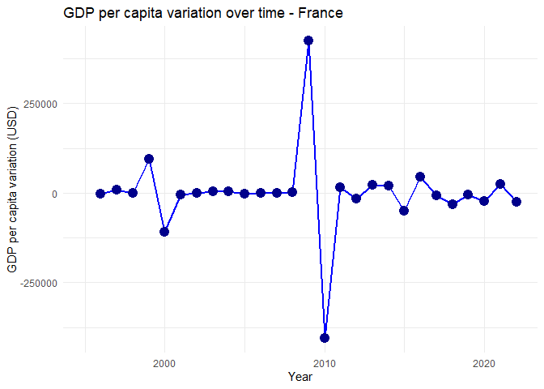
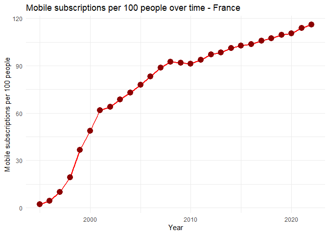
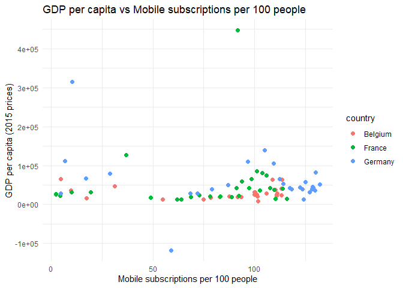
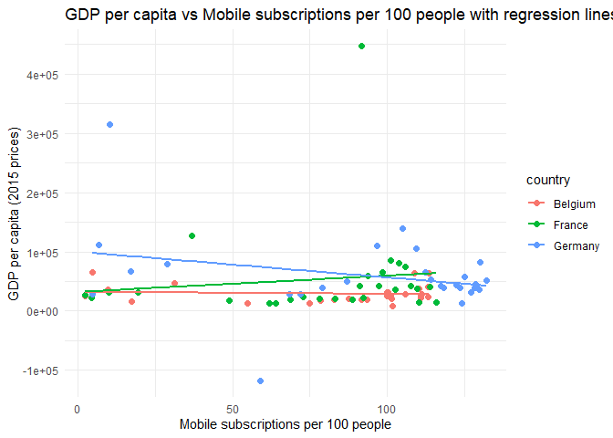
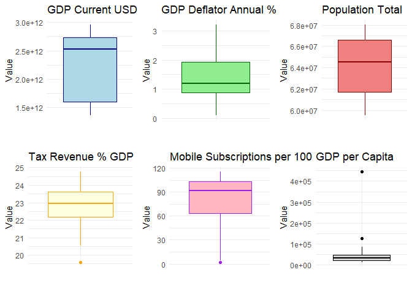

# Class 1 - Data Analysis in R
Tiago Afonso
2025-09-10

-   [Class 1 - Data Analysis in `R`](#class-1---data-analysis-in-r)
    -   [**Data Collection**](#data-collection)
    -   [**Exercise 1**](#exercise-1)
    -   [**Exercise 2**](#exercise-2)
    -   [**Exercise 3**](#exercise-3)
    -   [**Exercise 4**](#exercise-4)
    -   [**Exercise 5**](#exercise-5)

# Class 1 - Data Analysis in `R`

### **Data Collection**

**WDI - World Development Indicators**

``` r
library(tidyverse)
library(WDI)
```

Sample:

<table>
<thead>
<tr>
<th>Country</th>
<th>Code</th>
</tr>
</thead>
<tbody>
<tr>
<td>🇩🇪 Germany</td>
<td>DEU</td>
</tr>
<tr>
<td>🇫🇷 France</td>
<td>FRA</td>
</tr>
<tr>
<td>🇧🇪 Belgium</td>
<td>BEL</td>
</tr>
</tbody>
</table>

Series:

    `GDP (current US$)`
    `GDP deflator (base year varies by country)`
    `Tax revenue (% of GDP)`
    `Population, total`
    `Mobile cellular subscriptions (per 100 people)`

Time: 1990 - 2024

in `R`:

``` r
wdi_data <- WDI(
  country = c("DEU", "FRA", "BEL"),
  indicator = c(
    "NY.GDP.MKTP.CD",  # GDP (current US$)
    "NY.GDP.DEFL.KD.ZG",  # GDP deflator (annual %)
    "GC.TAX.TOTL.GD.ZS",  # Tax revenue (% of GDP)
    "SP.POP.TOTL",  # Population, total
    "IT.CEL.SETS.P2"  # Mobile cellular subscriptions (per 100 people)
  ),
  start = 1990,
  end = 2024,
  extra = TRUE
) |>
  rename(
    gdp_current_usd = NY.GDP.MKTP.CD,
    gdp_deflator_annual_pct = NY.GDP.DEFL.KD.ZG,
    tax_revenue_pct_gdp = GC.TAX.TOTL.GD.ZS,
    population_total = SP.POP.TOTL,
    mobile_subscriptions_per_100 = IT.CEL.SETS.P2
  )

head(wdi_data)
```

      country iso2c iso3c year status lastupdated gdp_current_usd
    1 Belgium    BE   BEL 1990         2025-07-01    205331747948
    2 Belgium    BE   BEL 1991         2025-07-01    210510999409
    3 Belgium    BE   BEL 1992         2025-07-01    234781652447
    4 Belgium    BE   BEL 1993         2025-07-01    224721795709
    5 Belgium    BE   BEL 1994         2025-07-01    244884129491
    6 Belgium    BE   BEL 1995         2025-07-01    288025588396
      gdp_deflator_annual_pct tax_revenue_pct_gdp population_total
    1                2.812404                  NA          9967379
    2                2.876624                  NA         10004486
    3                3.424525                  NA         10045158
    4                3.993232                  NA         10084475
    5                2.094305                  NA         10115603
    6                1.220770            25.62242         10136811
      mobile_subscriptions_per_100                region  capital longitude
    1                    0.4305411 Europe & Central Asia Brussels   4.36761
    2                    0.5148657 Europe & Central Asia Brussels   4.36761
    3                    0.6135903 Europe & Central Asia Brussels   4.36761
    4                    0.6747587 Europe & Central Asia Brussels   4.36761
    5                    1.2719107 Europe & Central Asia Brussels   4.36761
    6                    2.3303951 Europe & Central Asia Brussels   4.36761
      latitude      income        lending
    1  50.8371 High income Not classified
    2  50.8371 High income Not classified
    3  50.8371 High income Not classified
    4  50.8371 High income Not classified
    5  50.8371 High income Not classified
    6  50.8371 High income Not classified

``` r
summary(wdi_data)
```

       country             iso2c              iso3c                year     
     Length:105         Length:105         Length:105         Min.   :1990  
     Class :character   Class :character   Class :character   1st Qu.:1998  
     Mode  :character   Mode  :character   Mode  :character   Median :2007  
                                                              Mean   :2007  
                                                              3rd Qu.:2016  
                                                              Max.   :2024  
                                                                            
        status          lastupdated        gdp_current_usd    
     Length:105         Length:105         Min.   :2.053e+11  
     Class :character   Class :character   1st Qu.:5.272e+11  
     Mode  :character   Mode  :character   Median :1.967e+12  
                                           Mean   :1.905e+12  
                                           3rd Qu.:2.852e+12  
                                           Max.   :4.660e+12  
                                                              
     gdp_deflator_annual_pct tax_revenue_pct_gdp population_total  
     Min.   :-0.3438         Min.   : 9.796      Min.   : 9967379  
     1st Qu.: 1.1146         1st Qu.:11.386      1st Qu.:11331422  
     Median : 1.8014         Median :22.294      Median :64016890  
     Mean   : 1.8688         Mean   :19.163      Mean   :52125080  
     3rd Qu.: 2.0943         3rd Qu.:24.174      3rd Qu.:81438348  
     Max.   : 6.8440         Max.   :27.275      Max.   :83901923  
                             NA's   :10                            
     mobile_subscriptions_per_100    region            capital         
     Min.   :  0.3435             Length:105         Length:105        
     1st Qu.: 17.7537             Class :character   Class :character  
     Median : 92.0597             Mode  :character   Mode  :character  
     Mean   : 73.2396                                                  
     3rd Qu.:110.3775                                                  
     Max.   :132.0030                                                  
     NA's   :3                                                         
      longitude           latitude            income            lending         
     Length:105         Length:105         Length:105         Length:105        
     Class :character   Class :character   Class :character   Class :character  
     Mode  :character   Mode  :character   Mode  :character   Mode  :character  
                                                                                
                                                                                
                                                                                
                                                                                

The function `WDI()` downloads the data directly from the World Bank
API. The function `rename()` is used to rename the columns.

Cleaning data:

-   Filter for relevant years only (1995-2022)
-   Select relevant columns (`country`, `year`, `gdp_current_usd`,
    `gdp_deflator_annual_pct`, `population_total`,
    `tax_revenue_pct_gdp`, `mobile_subscriptions_per_100`)

``` r
wdi_data_clean <- wdi_data |>
  filter(year >= 1995 & year <= 2022) |>
  select(country, year, gdp_current_usd, gdp_deflator_annual_pct, population_total, tax_revenue_pct_gdp, mobile_subscriptions_per_100)

head(wdi_data_clean)
```

      country year gdp_current_usd gdp_deflator_annual_pct population_total
    1 Belgium 1995    288025588396               1.2207696         10136811
    2 Belgium 1996    279201433225               0.4766384         10156637
    3 Belgium 1997    252708051421               0.7576108         10181245
    4 Belgium 1998    258528339631               1.8056194         10203008
    5 Belgium 1999    258245733221               0.5989225         10226419
    6 Belgium 2000    236792460312               2.0145921         10251250
      tax_revenue_pct_gdp mobile_subscriptions_per_100
    1            25.62242                     2.330395
    2            26.02989                     4.723512
    3            26.56702                     9.596320
    4            27.16304                    17.237871
    5            27.00951                    31.167189
    6            27.27474                    54.907900

``` r
summary(wdi_data_clean)
```

       country               year      gdp_current_usd     gdp_deflator_annual_pct
     Length:84          Min.   :1995   Min.   :2.367e+11   Min.   :-0.3438        
     Class :character   1st Qu.:2002   1st Qu.:5.264e+11   1st Qu.: 0.9001        
     Mode  :character   Median :2008   Median :2.203e+12   Median : 1.4836        
                        Mean   :2008   Mean   :1.970e+12   Mean   : 1.5539        
                        3rd Qu.:2015   3rd Qu.:2.864e+12   3rd Qu.: 1.9393        
                        Max.   :2022   Max.   :4.348e+12   Max.   : 6.8440        
     population_total   tax_revenue_pct_gdp mobile_subscriptions_per_100
     Min.   :10136811   Min.   :10.29       Min.   :  2.268             
     1st Qu.:11317116   1st Qu.:11.28       1st Qu.: 68.617             
     Median :64540776   Median :22.63       Median : 99.089             
     Mean   :52360464   Mean   :19.61       Mean   : 84.648             
     3rd Qu.:81808274   3rd Qu.:24.48       3rd Qu.:110.925             
     Max.   :83797985   Max.   :27.27       Max.   :132.003             

### **Exercise 1**

Calculate the deflator for the base year **2015** for each country

Change the deflator base year to from 2020 to **2015**:

$$
Deflator\_{2015} = \frac{Deflator\_{t}}{Deflator\_{2015}} \times 100
$$

where t=1995,…,2022

``` r
wdi_data_clean <- wdi_data_clean |>
  group_by(country) |>
  mutate(
    gdp_deflator_base_2015 = (gdp_deflator_annual_pct / gdp_deflator_annual_pct[year == 2015]) * 100
  ) |>
  ungroup()
head(wdi_data)
```

      country iso2c iso3c year status lastupdated gdp_current_usd
    1 Belgium    BE   BEL 1990         2025-07-01    205331747948
    2 Belgium    BE   BEL 1991         2025-07-01    210510999409
    3 Belgium    BE   BEL 1992         2025-07-01    234781652447
    4 Belgium    BE   BEL 1993         2025-07-01    224721795709
    5 Belgium    BE   BEL 1994         2025-07-01    244884129491
    6 Belgium    BE   BEL 1995         2025-07-01    288025588396
      gdp_deflator_annual_pct tax_revenue_pct_gdp population_total
    1                2.812404                  NA          9967379
    2                2.876624                  NA         10004486
    3                3.424525                  NA         10045158
    4                3.993232                  NA         10084475
    5                2.094305                  NA         10115603
    6                1.220770            25.62242         10136811
      mobile_subscriptions_per_100                region  capital longitude
    1                    0.4305411 Europe & Central Asia Brussels   4.36761
    2                    0.5148657 Europe & Central Asia Brussels   4.36761
    3                    0.6135903 Europe & Central Asia Brussels   4.36761
    4                    0.6747587 Europe & Central Asia Brussels   4.36761
    5                    1.2719107 Europe & Central Asia Brussels   4.36761
    6                    2.3303951 Europe & Central Asia Brussels   4.36761
      latitude      income        lending
    1  50.8371 High income Not classified
    2  50.8371 High income Not classified
    3  50.8371 High income Not classified
    4  50.8371 High income Not classified
    5  50.8371 High income Not classified
    6  50.8371 High income Not classified

The `mutate()` function is used to create a new columns in a data frame.
The `group_by()` function is used to group the data by country, so that
the calculations are done for each country separately. The `ungroup()`
function is used to remove the grouping structure.

### **Exercise 2**

Calculate the GDP at **2015** prices for each country

Change the GDP current to 2015 prices:

$$
GDP\_{2015} = \frac{GDP\_{current}}{Deflator\_{2015}} \times 100
$$

where t=1995,…,2022

``` r
wdi_data_clean <- wdi_data_clean |>
  mutate(
    gdp_2015_usd = (gdp_current_usd / gdp_deflator_base_2015) * 100
  )
```

### **Exercise 3**

Chart the evolution of GDP per capita variation and subscriptions over
time *(for one country only)*

1.  Calculate GDP per capita at 2015 prices

$$
GDP\_{per capita 2015} = \frac{GDP\_{2015}}{Population\_{total}}
$$

``` r
wdi_data_clean <- wdi_data_clean |>
  mutate(
    gdppc = gdp_2015_usd / population_total
  )

wdi_data_france <- wdi_data_clean |>
  filter(country == "France")
```

1.  Calculate the annual variation of GDP per capita at 2015 prices

*Δ**G**D**P**p**c* = *G**D**P**p**c*<sub>*t*</sub> − *G**D**P**p**c*<sub>*t* − 1</sub>

where t=1996,…,2022

``` r
wdi_data_france <- wdi_data_france |>
  arrange(year) |>
  mutate(
    gdppc_var = gdppc - lag(gdppc)
  )
```

1.  Chart the evolution of GDP per capita variation and subscriptions
    over time for France

``` r
# Plot 1: GDP per capita variation over time
ggplot(wdi_data_france, aes(x = year, y = gdppc_var)) +
    geom_line(color = "blue", size = 1) +
    geom_point(color = "darkblue", size = 4) +
    labs(
        title = "GDP per capita variation over time - France",
        x = "Year",
        y = "GDP per capita variation (USD)"
    ) +
    theme_minimal()
```

    Warning: Using `size` aesthetic for lines was deprecated in ggplot2 3.4.0.
    ℹ Please use `linewidth` instead.

    Warning: Removed 1 row containing missing values or values outside the scale range
    (`geom_line()`).

    Warning: Removed 1 row containing missing values or values outside the scale range
    (`geom_point()`).



``` r
# Plot 2: Mobile subscriptions per 100 people over time
ggplot(wdi_data_france, aes(x = year, y = mobile_subscriptions_per_100)) +
    geom_line(color = "red", size = 1) +
    geom_point(color = "darkred", size = 4) +
    labs(
        title = "Mobile subscriptions per 100 people over time - France",
        x = "Year",
        y = "Mobile subscriptions per 100 people"
    ) +
    theme_minimal()
```



### **Exercise 4**

Is there any relationship between GDP per capita and subscriptions?
*(for each country)*

1.  Using a scatter plot, for each country, plot GDP per capita at 2015
    prices against mobile subscriptions per 100 people.

``` r
ggplot(wdi_data_clean, aes(x = mobile_subscriptions_per_100, y = gdppc)) +
    geom_point(aes(color = country), size = 2) +
    labs(
        title = "GDP per capita vs Mobile subscriptions per 100 people",
        x = "Mobile subscriptions per 100 people",
        y = "GDP per capita (2015 prices)"
    ) +
    theme_minimal()
```



Adding a linear regression to each country:

``` r
ggplot(wdi_data_clean, aes(x = mobile_subscriptions_per_100, y = gdppc)) +
    geom_point(aes(color = country), size = 2) +
    geom_smooth(aes(color = country), method = "lm", se = FALSE) +
    labs(
        title = "GDP per capita vs Mobile subscriptions per 100 people with regression lines",
        x = "Mobile subscriptions per 100 people",
        y = "GDP per capita (2015 prices)"
    ) +
    theme_minimal()
```

    `geom_smooth()` using formula = 'y ~ x'



If flat, no relationship. If upward sloping, positive relationship. If
downward sloping, negative relationship.

Answering the same question using correlation (pearson correlation):

``` r
wdi_data_clean %>%
  group_by(country) %>%
  summarize(correlation = cor(gdppc, mobile_subscriptions_per_100, use = "complete.obs"))
```

    # A tibble: 3 × 2
      country correlation
      <chr>         <dbl>
    1 Belgium     -0.0854
    2 France       0.116 
    3 Germany     -0.279 

The `cor()` function is used to calculate the correlation between two
variables. The `use = "complete.obs"` argument is used to handle missing
values by only using complete observations.

### **Exercise 5**

Calculate the two statistical moments for all variables *(France only)*

``` r
#unselect the  country and year columns

wdi_data_france_ <- wdi_data_france %>%
  select(-country, -year)

library(psych)
```


    Attaching package: 'psych'

    The following objects are masked from 'package:ggplot2':

        %+%, alpha

``` r
describe(wdi_data_france_)
```

                                 vars  n          mean           sd        median
    gdp_current_usd                 1 28  2.281515e+12 5.734400e+11  2.529638e+12
    gdp_deflator_annual_pct         2 28  1.370000e+00 7.700000e-01  1.180000e+00
    population_total                3 28  6.412447e+07 2.795018e+06  6.454078e+07
    tax_revenue_pct_gdp             4 28  2.279000e+01 1.270000e+00  2.296000e+01
    mobile_subscriptions_per_100    5 28  7.764000e+01 3.460000e+01  9.145000e+01
    gdp_deflator_base_2015          6 28  1.207900e+02 6.800000e+01  1.040700e+02
    gdp_2015_usd                    7 28  3.437720e+12 5.281309e+12  1.874403e+12
    gdppc                           8 28  5.326881e+04 8.166432e+04  3.119904e+04
    gdppc_var                       9 27 -4.423500e+02 1.198581e+05 -2.903700e+02
                                       trimmed          mad           min
    gdp_current_usd               2.302411e+12 4.959962e+11  1.360959e+12
    gdp_deflator_annual_pct       1.330000e+00 7.800000e-01  1.100000e-01
    population_total              6.417840e+07 3.460511e+06  5.954129e+07
    tax_revenue_pct_gdp           2.286000e+01 1.160000e+00  1.960000e+01
    mobile_subscriptions_per_100  8.073000e+01 2.534000e+01  2.270000e+00
    gdp_deflator_base_2015        1.169500e+02 6.844000e+01  9.340000e+00
    gdp_2015_usd                  2.418740e+12 1.294003e+12  8.171846e+11
    gdppc                         3.714831e+04 1.713092e+04  1.326884e+04
    gdppc_var                    -8.142000e+02 2.282591e+04 -4.043733e+05
                                          max        range  skew kurtosis
    gdp_current_usd              2.966434e+12 1.605475e+12 -0.47    -1.50
    gdp_deflator_annual_pct      3.220000e+00 3.110000e+00  0.59    -0.30
    population_total             6.806502e+07 8.523721e+06 -0.23    -1.43
    tax_revenue_pct_gdp          2.479000e+01 5.190000e+00 -0.54    -0.17
    mobile_subscriptions_per_100 1.159500e+02 1.136800e+02 -0.98    -0.35
    gdp_deflator_base_2015       2.839000e+02 2.745600e+02  0.59    -0.30
    gdp_2015_usd                 2.890753e+13 2.809034e+13  3.99    16.35
    gdppc                        4.467488e+05 4.334800e+05  3.99    16.29
    gdppc_var                    4.243318e+05 8.287051e+05  0.22     7.66
                                           se
    gdp_current_usd              1.083700e+11
    gdp_deflator_annual_pct      1.500000e-01
    population_total             5.282087e+05
    tax_revenue_pct_gdp          2.400000e-01
    mobile_subscriptions_per_100 6.540000e+00
    gdp_deflator_base_2015       1.285000e+01
    gdp_2015_usd                 9.980736e+11
    gdppc                        1.543310e+04
    gdppc_var                    2.306670e+04

Check for the existence of **outliers** for each variable *(France
only)*

#### **Formulae for Outlier Detection**

*I**Q**R* = *Q*3 − *Q*1

*L**o**w**e**r* *L**i**m**i**t* = *Q*1 − 1.5 × *I**Q**R*

*U**p**p**e**r* *L**i**m**i**t* = *Q*3 + 1.5 × *I**Q**R*

``` r
wdi_data_france_outliers <- wdi_data_france_ %>%
  gather(key = "variable", value = "value")
```

    Warning: attributes are not identical across measure variables; they will be
    dropped

``` r
head(wdi_data_france_outliers)
```

    # A tibble: 6 × 2
      variable          value
      <chr>             <dbl>
    1 gdp_current_usd 1.60e12
    2 gdp_current_usd 1.60e12
    3 gdp_current_usd 1.45e12
    4 gdp_current_usd 1.50e12
    5 gdp_current_usd 1.49e12
    6 gdp_current_usd 1.36e12

``` r
wdi_data_france_outliers_summary <- wdi_data_france_outliers %>%
  group_by(variable) %>%
  summarize(
    Q1 = quantile(value, 0.25, na.rm = TRUE),
    Q3 = quantile(value, 0.75, na.rm = TRUE),
    IQR = IQR(value, na.rm = TRUE),
    Lower_Limit = Q1 - 1.5 * IQR,
    Upper_Limit = Q3 + 1.5 * IQR
  )
wdi_data_france_outliers_summary
```

    # A tibble: 9 × 6
      variable                            Q1      Q3     IQR Lower_Limit Upper_Limit
      <chr>                            <dbl>   <dbl>   <dbl>       <dbl>       <dbl>
    1 gdp_2015_usd                  1.27e+12 3.08e12 1.81e12   -1.45e+12     5.80e12
    2 gdp_current_usd               1.60e+12 2.74e12 1.14e12   -1.11e+11     4.45e12
    3 gdp_deflator_annual_pct       8.69e- 1 1.92e 0 1.05e 0   -7.04e- 1     3.49e 0
    4 gdp_deflator_base_2015        7.66e+ 1 1.69e 2 9.24e 1   -6.20e+ 1     3.08e 2
    5 gdppc                         2.00e+ 4 4.68e 4 2.68e 4   -2.02e+ 4     8.69e 4
    6 gdppc_var                    -1.10e+ 4 1.22e 4 2.32e 4   -4.59e+ 4     4.71e 4
    7 mobile_subscriptions_per_100  6.34e+ 1 1.03e 2 3.96e 1    4.04e+ 0     1.62e 2
    8 population_total              6.17e+ 7 6.66e 7 4.89e 6    5.44e+ 7     7.39e 7
    9 tax_revenue_pct_gdp           2.22e+ 1 2.36e 1 1.43e 0    2.00e+ 1     2.58e 1

If values are below the Lower Limit or above the Upper Limit, they are
considered outliers.

``` r
# Identify outliers
wdi_data_france_outliers <- wdi_data_france_outliers %>%
  left_join(wdi_data_france_outliers_summary, by = "variable") %>%
  mutate(
    is_outlier = ifelse(value < Lower_Limit | value > Upper_Limit, TRUE, FALSE)
  )

#count number of outliers for each variable
wdi_data_france_outliers %>%
  group_by(variable) %>%
  summarize(num_outliers = sum(is_outlier, na.rm = TRUE))
```

    # A tibble: 9 × 2
      variable                     num_outliers
      <chr>                               <int>
    1 gdp_2015_usd                            2
    2 gdp_current_usd                         0
    3 gdp_deflator_annual_pct                 0
    4 gdp_deflator_base_2015                  0
    5 gdppc                                   2
    6 gdppc_var                               5
    7 mobile_subscriptions_per_100            1
    8 population_total                        0
    9 tax_revenue_pct_gdp                     1

Boxplot for each variable *(France only)*

``` r
library(gridExtra)
```


    Attaching package: 'gridExtra'

    The following object is masked from 'package:dplyr':

        combine

``` r
# Create individual boxplots for each variable with colors
p1 <- wdi_data_france %>%
    ggplot(aes(x = "", y = gdp_current_usd)) +
    geom_boxplot(fill = "lightblue", color = "darkblue") +
    labs(title = "GDP Current USD", x = "", y = "Value") +
    theme_minimal()

p2 <- wdi_data_france %>%
    ggplot(aes(x = "", y = gdp_deflator_annual_pct)) +
    geom_boxplot(fill = "lightgreen", color = "darkgreen") +
    labs(title = "GDP Deflator Annual %", x = "", y = "Value") +
    theme_minimal()

p3 <- wdi_data_france %>%
    ggplot(aes(x = "", y = population_total)) +
    geom_boxplot(fill = "lightcoral", color = "darkred") +
    labs(title = "Population Total", x = "", y = "Value") +
    theme_minimal()

p4 <- wdi_data_france %>%
    ggplot(aes(x = "", y = tax_revenue_pct_gdp)) +
    geom_boxplot(fill = "lightyellow", color = "orange") +
    labs(title = "Tax Revenue % GDP", x = "", y = "Value") +
    theme_minimal()

p5 <- wdi_data_france %>%
    ggplot(aes(x = "", y = mobile_subscriptions_per_100)) +
    geom_boxplot(fill = "lightpink", color = "purple") +
    labs(title = "Mobile Subscriptions per 100", x = "", y = "Value") +
    theme_minimal()

p6 <- wdi_data_france %>%
    ggplot(aes(x = "", y = gdppc)) +
    geom_boxplot(fill = "lightgray", color = "black") +
    labs(title = "GDP per Capita", x = "", y = "Value") +
    theme_minimal()

# Arrange plots in a grid
grid.arrange(p1, p2, p3, p4, p5, p6, ncol = 3, nrow = 2)
```


