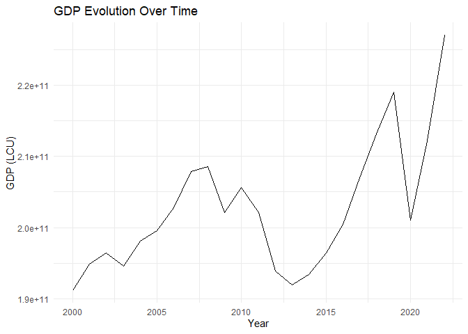
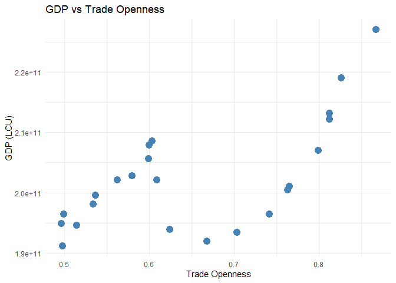
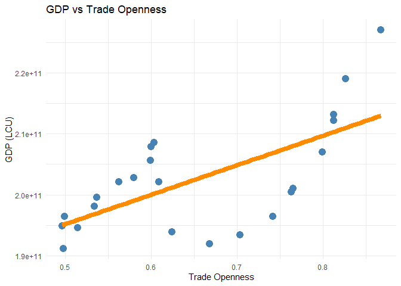
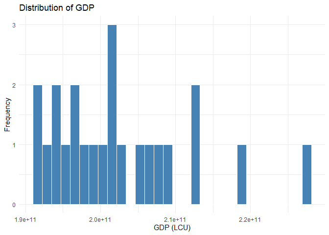

# Class2 - Introduction to R
Tiago Afonso
2025-09-12

-   [Calculations in R](#calculations-in-r)
-   [Introducing data](#introducing-data)
    -   [manually](#manually)
    -   [Import .csv file](#import-.csv-file)
    -   [Calculations between columns of a
        data.frame](#calculations-between-columns-of-a-data.frame)
-   [Graphics](#graphics)
    -   [Line plot](#line-plot)
-   [Descriptive Statistics](#descriptive-statistics)
-   [Types of data in Econometrics](#types-of-data-in-econometrics)

# Calculations in R

Perform simple mathematical **calculations**:

``` r
2+2
```

    [1] 4

Assign values to variables:

``` r
a <- 2
b <- 3
```

Perform calculations with variables:

``` r
a + b
```

    [1] 5

``` r
a * b
```

    [1] 6

# Introducing data

## manually

Clear the environment:

``` r
rm(list = ls())
```

Create a vector:

``` r
v1 <- c(1, 2, 3, 4, 5)
v2 <- c(6, 7, 8, 9, 10)
```

Create a `data.frame` (table):

``` r
dados <- data.frame(v1, v2)
```

## Import .csv file

Clear data:

``` r
rm(list = ls())
```

Load libraries:

``` r
library(readxl) # for Excel files
library(tidyverse) # for data manipulation
```

    ── Attaching core tidyverse packages ──────────────────────── tidyverse 2.0.0 ──
    ✔ dplyr     1.1.4     ✔ readr     2.1.5
    ✔ forcats   1.0.0     ✔ stringr   1.5.1
    ✔ ggplot2   3.5.1     ✔ tibble    3.2.1
    ✔ lubridate 1.9.3     ✔ tidyr     1.3.1
    ✔ purrr     1.0.2     
    ── Conflicts ────────────────────────────────────────── tidyverse_conflicts() ──
    ✖ dplyr::filter() masks stats::filter()
    ✖ dplyr::lag()    masks stats::lag()
    ℹ Use the conflicted package (<http://conflicted.r-lib.org/>) to force all conflicts to become errors

Import .csv file:

``` r
dados <- read.csv("Data.csv")
```

Remove unnecessary columns:

``` r
dados2 <- dados |> 
    select(-"Country.Code", -"Time.Code")
```

View column names:

``` r
colnames(dados2)
```

    [1] "Country.Name"                                                                       
    [2] "Time"                                                                               
    [3] "Tariff.rate..applied..simple.mean..all.products......TM.TAX.MRCH.SM.AR.ZS."         
    [4] "Tariff.rate..applied..simple.mean..manufactured.products......TM.TAX.MANF.SM.AR.ZS."
    [5] "GDP..constant.LCU...NY.GDP.MKTP.KN."                                                
    [6] "Trade....of.GDP...NE.TRD.GNFS.ZS."                                                  
    [7] "Exports.of.goods.and.services..constant.LCU...NE.EXP.GNFS.KN."                      
    [8] "Imports.of.goods.and.services..constant.LCU...NE.IMP.GNFS.KN."                      

Simplify column names:

``` r
dados2 <- dados2 |> 
    rename(
    Country = "Country.Name",
    Year = "Time",
    tariff = "Tariff.rate..applied..simple.mean..all.products......TM.TAX.MRCH.SM.AR.ZS.",
    tarif_man = "Tariff.rate..applied..simple.mean..manufactured.products......TM.TAX.MANF.SM.AR.ZS.",
    gdp = "GDP..constant.LCU...NY.GDP.MKTP.KN.",
    trade = "Trade....of.GDP...NE.TRD.GNFS.ZS.",
    x = "Exports.of.goods.and.services..constant.LCU...NE.EXP.GNFS.KN.",
    m = "Imports.of.goods.and.services..constant.LCU...NE.IMP.GNFS.KN."
    )
```

Filter rows for year\>=2000 and year\<=2022:

``` r
dados2 <- dados2 |> 
    filter(Year >= 2000 & Year <= 2022)
```

## Calculations between columns of a data.frame

Calculate trade openness:

$$
openess_t = \frac{x_t + m_t}{gdp_t}
$$

Calculate in R with `mutate()`:

``` r
dados2 <- dados2 |> 
    mutate(openess = (x + m) / gdp)
```

# Graphics

## Line plot

Plot of GDP evolution over time:

``` r
ggplot(dados2, aes(x = Year, y = gdp)) +
    geom_line() +
    labs(title = "GDP Evolution Over Time",
         x = "Year",
         y = "GDP (LCU)") +
    theme_minimal()
```



Scatter plot between GDP and economic openness:

``` r
ggplot(dados2, aes(x = openess, y = gdp)) +
    geom_point(color="steelblue",size=4) +
    labs(title = "GDP vs Trade Openness",
         x = "Trade Openness",
         y = "GDP (LCU)") +
    theme_minimal()
```



Scatter with a regression line:

``` r
ggplot(dados2, aes(x = openess, y = gdp)) +
    geom_point(color="steelblue",size=4) +
    geom_smooth(method = "lm", se = FALSE, color = "darkorange", size=3) +
    labs(title = "GDP vs Trade Openness",
         x = "Trade Openness",
         y = "GDP (LCU)") +
    theme_minimal()
```

    Warning: Using `size` aesthetic for lines was deprecated in ggplot2 3.4.0.
    ℹ Please use `linewidth` instead.

    `geom_smooth()` using formula = 'y ~ x'



Histogram of exports (`x`):

``` r
ggplot(dados2, aes(x = gdp)) +
    geom_histogram(fill = "steelblue", color = "white") +
    labs(title = "Distribution of GDP",
         x = "GDP (LCU)",
         y = "Frequency") +
    theme_minimal()
```

    `stat_bin()` using `bins = 30`. Pick better value with `binwidth`.



# Descriptive Statistics

``` r
summary(dados2)
```

       Country               Year         tariff           tarif_man        
     Length:23          Min.   :2000   Length:23          Length:23         
     Class :character   1st Qu.:2006   Class :character   Class :character  
     Mode  :character   Median :2011   Mode  :character   Mode  :character  
                        Mean   :2011                                        
                        3rd Qu.:2016                                        
                        Max.   :2022                                        
          gdp                trade              x                   m            
     Min.   :1.912e+11   Min.   : 61.14   Min.   :4.214e+10   Min.   :5.303e+10  
     1st Qu.:1.956e+11   1st Qu.: 66.27   1st Qu.:5.033e+10   1st Qu.:5.841e+10  
     Median :2.010e+11   Median : 73.01   Median :6.079e+10   Median :6.593e+10  
     Mean   :2.026e+11   Mean   : 74.40   Mean   :6.470e+10   Mean   :6.823e+10  
     3rd Qu.:2.075e+11   3rd Qu.: 80.43   3rd Qu.:7.645e+10   3rd Qu.:7.694e+10  
     Max.   :2.270e+11   Max.   :101.36   Max.   :9.830e+10   Max.   :9.856e+10  
        openess      
     Min.   :0.4961  
     1st Qu.:0.5494  
     Median :0.6087  
     Mean   :0.6528  
     3rd Qu.:0.7642  
     Max.   :0.8671  

# Types of data in Econometrics

-   Cross-sectional data: multiple entities, 1 time period
-   Time series: 1 entity, multiple time periods
-   Panel data: multiple entities, multiple time periods
